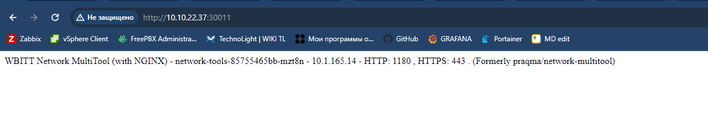

# Домашнее задание к занятию «Сетевое взаимодействие в K8S. Часть 1»

### Задание 1. Создать Deployment и обеспечить доступ к контейнерам приложения по разным портам из другого Pod внутри кластера

> 1. Создать Deployment приложения, состоящего из двух контейнеров (nginx и multitool), с количеством реплик 3 шт.

> 2. Создать Service, который обеспечит доступ внутри кластера до контейнеров приложения из п.1 по порту 9001 — nginx 80, по 9002 — multitool 8080.

> 3. Создать отдельный Pod с приложением multitool и убедиться с помощью `curl`, что из пода есть доступ до приложения из п.1 по разным портам в разные контейнеры.

> 4. Продемонстрировать доступ с помощью `curl` по доменному имени сервиса.

> 5. Предоставить манифесты Deployment и Service в решении, а также скриншоты или вывод команды п.4.

Скриншоты выше, манифесты в одном файле [deployment.yaml](./deployment.yaml)
------

### Задание 2. Создать Service и обеспечить доступ к приложениям снаружи кластера

> 1. Создать отдельный Service приложения из Задания 1 с возможностью доступа снаружи кластера к nginx, используя тип NodePort.

> 2. Продемонстрировать доступ с помощью браузера или `curl` с локального компьютера.

> 3. Предоставить манифест и Service в решении, а также скриншоты или вывод команды п.2.

Манифест вынес отдельным [файлом](./nodeport.yaml), так как задание другое.
